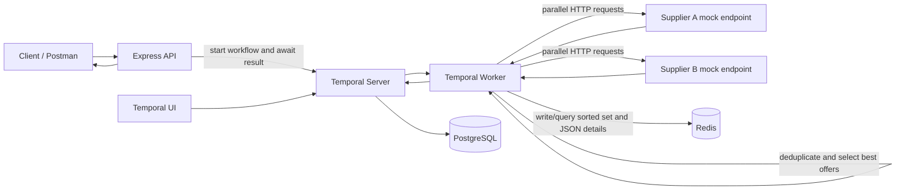

# Hotel Offer Orchestrator

A TypeScript/Express service that requests hotel offers from two mock suppliers in parallel using Temporal, chooses one best offer per hotel, persists the result in Redis, and supports Redis-backed price filtering.

## Architecture



## Tech stack

- Node.js 20 and TypeScript (strict mode)
- Express 4 for the API and mock supplier endpoints
- Temporal for durable workflow orchestration and retrying activities
- Redis sorted sets and JSON string values for persistence and price-range queries
- Pino structured logging
- Docker Compose, PostgreSQL, Temporal UI, and Jest

## Prerequisites

- Node.js 20 or newer and npm (for local development)
- Docker Desktop with Docker Compose v2 (for the full stack)

## Local setup

1. Copy `.env.example` to `.env` and adjust values if needed.
2. Start Redis, PostgreSQL, and Temporal using Docker Compose, or provide compatible local services.
3. Install and compile:

   ```sh
   npm install
   npm run build
   ```

4. Start the API and worker in separate terminals:

   ```sh
   npm start
   npm run start:worker
   ```

   For watch mode, use `npm run dev` after the backing services are available.

5. Request offers:

   ```sh
   curl "http://localhost:3000/api/hotels?city=delhi"
   ```

## Docker setup and deployment

Start all services from this folder:

```sh
docker compose up --build
```

The API becomes available at `http://localhost:3000`, and Temporal UI is available at `http://localhost:8080`. Redis and Temporal are persisted in named Docker volumes. For a detached deployment, run `docker compose up --build -d`; inspect logs with `docker compose logs -f api worker temporal`.

The API waits for healthy Redis and Temporal services, and the worker waits for those dependencies and the API. Temporal uses PostgreSQL for its persistence store.

## GitHub Codespaces (no local Docker required)

The repository includes a dev container configured with Docker-in-Docker. In GitHub, open the repository's **Code** menu, choose **Codespaces**, then **Create codespace on main**. Choose a machine with at least 4 cores and 16 GB RAM when available because Temporal and PostgreSQL run alongside the API and worker. Codespaces installs project dependencies and starts the Compose stack automatically. Wait for the forwarded port notification; open the **Hotel Offer API** port to use `/api/hotels?city=delhi`. Port 3000 is configured public so its temporary forwarded URL can be used outside the Codespace; Temporal UI on port 8080 remains private. Stop or delete the Codespace when finished because Codespaces usage may incur charges.

## Environment variables

| Variable | Default | Description |
| --- | --- | --- |
| `PORT` | `3000` | Express listen port |
| `REDIS_URL` | `redis://localhost:6379` | Redis connection URL |
| `TEMPORAL_ADDRESS` | `localhost:7233` | Temporal frontend address |
| `TEMPORAL_NAMESPACE` | `default` | Temporal namespace |
| `TASK_QUEUE` | `hotel-offers` | Workflow task queue |
| `SUPPLIER_BASE_URL` | `http://localhost:3000` | Base URL used by activities and health checks to call supplier HTTP endpoints |
| `SUPPLIER_TIMEOUT_MS` | `5000` | Timeout per supplier HTTP request |
| `SIMULATE_DOWN` | unset | Set to `A` or `B` to make that mock supplier respond unavailable |
| `REDIS_TTL_SECONDS` | `3600` | TTL for city index and hotel detail values |
| `LOG_LEVEL` | `info` | Pino log level |

## API

### `GET /api/hotels`

Required query parameter: `city`. Optional `minPrice`, `maxPrice`, and `simulateDown` (`A` or `B`) are supported. Each supplied price must be a finite number, and when both are supplied `minPrice` cannot exceed `maxPrice`.

```sh
curl "http://localhost:3000/api/hotels?city=delhi"
curl "http://localhost:3000/api/hotels?city=delhi&minPrice=5000&maxPrice=6000"
curl "http://localhost:3000/api/hotels?city=delhi&simulateDown=A"
```

Successful response (the returned list is sorted by normalized hotel name):

```json
[
  { "name": "Delhi Residency", "price": 5100, "supplier": "Supplier B", "commissionPct": 16 },
  { "name": "Holtin", "price": 5340, "supplier": "Supplier B", "commissionPct": 20 },
  { "name": "Imperial", "price": 7500, "supplier": "Supplier A", "commissionPct": 15 },
  { "name": "Palm Court", "price": 7900, "supplier": "Supplier B", "commissionPct": 10 },
  { "name": "Radison", "price": 5900, "supplier": "Supplier A", "commissionPct": 13 },
  { "name": "The Grand", "price": 8200, "supplier": "Supplier A", "commissionPct": 12 }
]
```

Each response item has exactly `name`, `price`, `supplier`, and `commissionPct`. Empty city matches return `[]`. Missing city, malformed prices, and invalid ranges return HTTP 400. If both suppliers are unavailable, the API returns HTTP 503; if only one is unavailable, the available supplier's offers are still returned.

### Mock suppliers

- `GET /supplierA/hotels?city=delhi`
- `GET /supplierB/hotels?city=mumbai`

Both return static supplier records, including `hotelId` and `city` for their mock API contract. Unsupported cities return `[]`. Pass `fail=true` to an individual mock URL to simulate its outage. `SIMULATE_DOWN=A|B` also forces the configured mock offline. The `simulateDown=A|B` parameter on `/api/hotels` is a convenience for exercising graceful degradation end to end.

### `GET /health`

Checks both supplier endpoints, Redis, and Temporal. The JSON reports each dependency as `up` or `down`. It returns 200 for `ok` or `degraded`, and 503 for `down` (either core dependency is unavailable or both suppliers are unavailable).

## Offer selection and Redis filtering

Supplier requests are Temporal activities executed concurrently with `Promise.allSettled`. The workflow applies up to three attempts with exponential backoff to each supplier activity. A failed supplier contributes an empty offer list after retries; failure of both suppliers becomes HTTP 503.

Names are matched after trimming and lowercasing. The displayed name preserves the selected supplier's original spelling and whitespace. The lowest price wins. For equal prices, the higher commission percentage wins; if price and commission are both tied, Supplier A wins. The selected list is written to Redis before it is returned.

For each city, Redis stores a sorted set at `hotels:<city>:prices` scored by price, and one JSON detail value per normalized hotel name under `hotels:<city>:hotel:<encoded-name>`. Writes replace the city's previous index and apply `REDIS_TTL_SECONDS`. Every API response is read back from Redis. Range filters use `ZRANGEBYSCORE`, with `-inf` and `+inf` for omitted bounds; filtering is not performed in application memory.

## Postman

Import `postman/hotel-orchestrator.postman_collection.json` into Postman and set the collection variable `baseUrl` to `http://localhost:3000`. The collection includes valid overlap assertions, Redis range filtering, empty city results, graceful degradation, validation errors, and health checks.

## Project structure

```text
src/
  activities/       Temporal activity implementations (HTTP suppliers and Redis)
  config/           Environment, Pino, and Redis configuration
  mock/             Static supplier data
  routes/           Hotel, health, and mock supplier endpoints
  services/         Offer selection and Redis persistence/query code
  types/            Shared TypeScript contracts
  workflows/        Deterministic Temporal workflow and exports
  server.ts         Express API process
  worker.ts         Temporal worker process
test/
  dedupe.test.ts    Offer selection unit tests
postman/
  hotel-orchestrator.postman_collection.json
```

## Tests

```sh
npm test
npm run build
```

## Assumptions

- Supplier fixtures are static, in-process mock APIs, and cities are compared case-insensitively.
- A selected offer is unique by trimmed, case-insensitive hotel name within a city.
- If only one supplier call succeeds, its valid offers are sufficient for a response.
- Redis is the source used to construct the API result, including unfiltered requests.
- In a real deployment, configure credentials, TLS, network access, durable secrets, and suitable resource limits for Redis, PostgreSQL, and Temporal.
